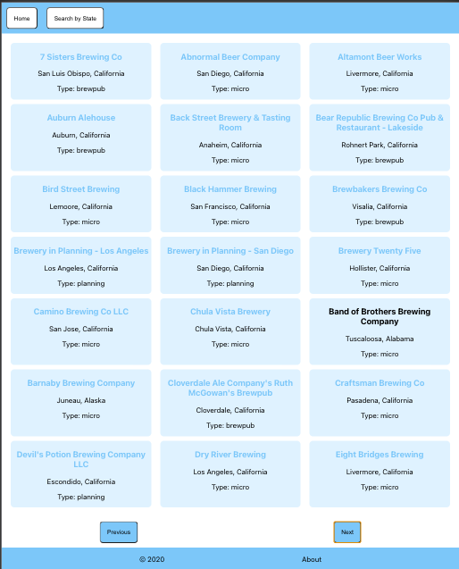

<h1>Week 10 - Week 13 DigitalCrafts Full-Stack Immersive</h1>

- Coursework on React and Redux. It contains assignments, files, and screenshots from week 10, 11, 12, and 13.

**Week 10 Day 1**

- Prompt was to recreate a sample website using React components.

**Week 10 Day 2**

- Prompt was to connect a react app to an API and perform CRUD operations.

**Week 10 Day 5**

- Prompt was to create a pie chart using react-minimal-pie-chart

**Week 11 Day 2**

- Algorithm practice - see file for 7 solved algorithms.

**Week 12 Day 2**

- Prompt was to create a basic to do app with Flutter.

